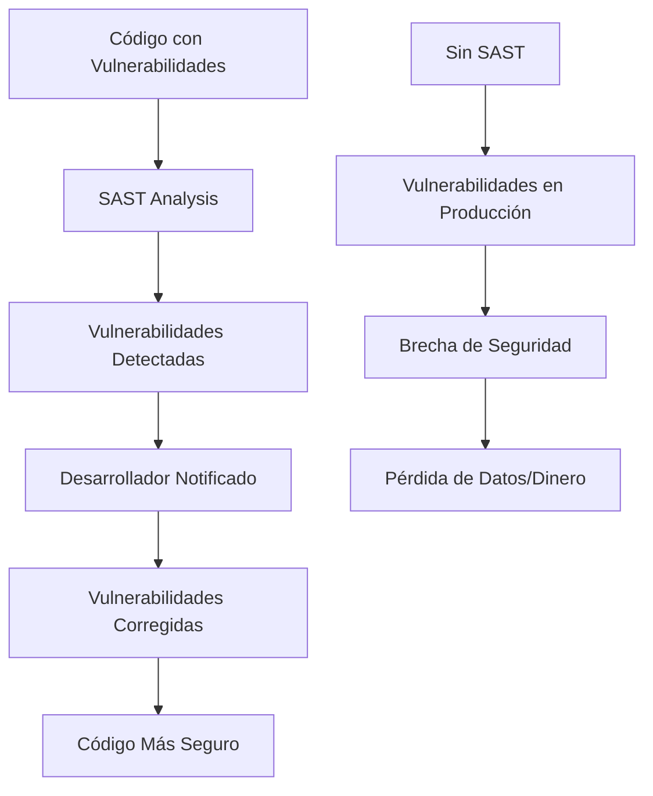

# Tutorial Interactivo: Bearer CLI para Desarrolladores

Un tutorial paso a paso para aprender análisis de seguridad estático con Bearer CLI.

## 🎯 Objetivos del Tutorial

Al finalizar este tutorial, serás capaz de:

- ✅ Entender qué es SAST y por qué es importante
- ✅ Instalar y configurar Bearer CLI
- ✅ Realizar análisis de seguridad básicos y avanzados
- ✅ Interpretar reportes de seguridad
- ✅ Integrar Bearer CLI en tu workflow de desarrollo
- ✅ Configurar análisis automatizados en CI/CD

## 📋 Prerrequisitos

- Conocimientos básicos de desarrollo web
- Familiaridad con línea de comandos
- WSL Ubuntu (para usuarios de Windows)
- Node.js 18+ instalado

## 🚀 Paso 1: Introducción a SAST

### ¿Qué es SAST?

**Static Application Security Testing (SAST)** es una técnica que analiza el código fuente para identificar vulnerabilidades de seguridad sin ejecutar la aplicación.

### ¿Por qué es importante?



### Tipos de Vulnerabilidades que Detecta SAST

| Categoría | Ejemplos | Impacto |
|-----------|----------|---------|
| **Inyección** | SQL Injection, XSS, Command Injection | Alto |
| **Autenticación** | Weak Passwords, Session Management | Alto |
| **Autorización** | Privilege Escalation, Access Control | Alto |
| **Configuración** | Insecure Headers, CORS Issues | Medio |
| **Secrets** | API Keys, Passwords, Tokens | Crítico |

## 🛠️ Paso 2: Instalación de Bearer CLI

### En WSL Ubuntu

```bash
# 1. Descargar e instalar Bearer CLI
curl -fsSL https://bearer.com/install.sh | sh

# 2. Verificar instalación
bearer --version

# 3. Configurar PATH (si es necesario)
echo 'export PATH="$HOME/.bearer/bin:$PATH"' >> ~/.bashrc
source ~/.bashrc
```

### Verificación de Instalación

```bash
# Verificar que Bearer CLI funciona
bearer --help

# Deberías ver algo como:
# bearer - Security scanner for your code
# 
# USAGE:
#   bearer [command]
# 
# COMMANDS:
#   scan     Scan your code for security issues
#   config   Manage bearer configuration
#   version  Show version information
```

## 🎮 Paso 3: Primer Escaneo

### Preparar un Proyecto de Prueba

```bash
# Crear directorio de prueba
mkdir bearer-tutorial
cd bearer-tutorial

# Crear un archivo JavaScript con vulnerabilidades intencionales
cat > vulnerable-app.js << 'EOF'
const express = require('express');
const mysql = require('mysql');
const app = express();

// Vulnerabilidad: SQL Injection
app.get('/user/:id', (req, res) => {
    const query = `SELECT * FROM users WHERE id = ${req.params.id}`;
    connection.query(query, (err, results) => {
        res.json(results);
    });
});

// Vulnerabilidad: XSS
app.get('/search', (req, res) => {
    const searchTerm = req.query.q;
    res.send(`<h1>Resultados para: ${searchTerm}</h1>`);
});

// Vulnerabilidad: Secretos hardcodeados
const dbPassword = 'super_secret_password_123';
const apiKey = 'sk-1234567890abcdef';

// Vulnerabilidad: Cookies inseguras
app.get('/login', (req, res) => {
    res.cookie('session', 'user123', {
        httpOnly: false,
        secure: false
    });
    res.send('Logged in');
});

app.listen(3000, () => {
    console.log('Server running on port 3000');
});
EOF

# Crear package.json
cat > package.json << 'EOF'
{
  "name": "vulnerable-app",
  "version": "1.0.0",
  "dependencies": {
    "express": "^4.18.0",
    "mysql": "^2.18.0"
  }
}
EOF
```

### Realizar el Primer Escaneo

```bash
# Escaneo básico
bearer scan .

# Deberías ver algo como:
# Analyzing codebase
# Loading rules
# Scanning target .
# Running Detectors
# Generating dataflow
# Evaluating rules
```

### Interpretar los Resultados

```bash
# Escaneo con formato HTML para mejor visualización
bearer scan . --format html --output security-report.html

# Abrir el reporte en el navegador
# (En WSL, puedes usar: explorer.exe security-report.html)
```

## 📊 Paso 4: Entender los Reportes

### Estructura del Reporte HTML

El reporte HTML incluye:

1. **Resumen Ejecutivo**
   - Número total de vulnerabilidades
   - Distribución por severidad
   - Tiempo de escaneo

2. **Lista de Vulnerabilidades**
   - ID de la regla
   - Severidad (Critical, High, Medium, Low, Warning)
   - Archivo y línea afectada
   - Descripción del problema
   - Recomendaciones de remediación

3. **Filtros y Búsqueda**
   - Filtrar por severidad
   - Buscar por archivo o regla
   - Ordenar por diferentes criterios

### Ejemplo de Vulnerabilidad Detectada

```json
{
  "id": "javascript_express_sql_injection",
  "severity": "critical",
  "message": "SQL injection vulnerability detected",
  "file": "vulnerable-app.js",
  "line": 7,
  "column": 20,
  "snippet": "const query = `SELECT * FROM users WHERE id = ${req.params.id}`;",
  "remediation": "Use parameterized queries or prepared statements"
}
```

## ⚙️ Paso 5: Configuración Avanzada

### Crear Archivo de Configuración

```bash
# Crear bearer.yml
cat > bearer.yml << 'EOF'
report:
  format: html
  output: "security-reports/"
  report: security
  severity: "critical,high,medium,low,warning"

scan:
  scanner:
    - sast
    - secrets
  skip-path:
    - node_modules
    - .git
    - "*.test.js"
    - "*.spec.js"

rules:
  # Habilitar reglas específicas
  - id: "javascript_express_sql_injection"
    severity: "critical"
    enabled: true
  
  # Deshabilitar reglas específicas
  - id: "javascript_console_log"
    severity: "warning"
    enabled: false
EOF
```

### Escaneo con Configuración Personalizada

```bash
# Usar configuración personalizada
bearer scan . --config bearer.yml

# Verificar configuración
bearer config
```

## 🔍 Paso 6: Tipos de Análisis

### Análisis SAST (Vulnerabilidades de Código)

```bash
# Solo análisis SAST
bearer scan . --scanner sast --format html --output sast-report.html
```

**Detecta:**
- Inyecciones SQL
- Cross-Site Scripting (XSS)
- Cross-Site Request Forgery (CSRF)
- Problemas de autenticación
- Configuraciones inseguras

### Detección de Secretos

```bash
# Solo detección de secretos
bearer scan . --scanner secrets --format html --output secrets-report.html
```

**Detecta:**
- API Keys
- Passwords
- Tokens de acceso
- Certificados
- Variables de entorno sensibles

### Análisis de Dependencias

```bash
# Análisis de dependencias vulnerables
bearer scan . --scanner dependencies --format json --output deps-report.json
```

## 🎯 Paso 7: Integración en Workflow

### Pre-commit Hook

```bash
# Crear pre-commit hook
cat > .git/hooks/pre-commit << 'EOF'
#!/bin/bash
echo "Running security scan..."

# Ejecutar Bearer CLI
bearer scan . --format json --output .bearer/scan.json

# Verificar si hay vulnerabilidades críticas
CRITICAL_COUNT=$(jq '.findings[] | select(.severity == "critical") | .id' .bearer/scan.json | wc -l)

if [ $CRITICAL_COUNT -gt 0 ]; then
    echo "❌ Commit blocked: $CRITICAL_COUNT critical vulnerabilities found"
    echo "Please fix the issues before committing"
    exit 1
else
    echo "✅ Security scan passed"
fi
EOF

# Hacer ejecutable
chmod +x .git/hooks/pre-commit
```

### Script de Validación

```bash
# Crear script de validación
cat > validate-security.sh << 'EOF'
#!/bin/bash

echo "🔍 Running security validation..."

# Crear directorio para reportes
mkdir -p security-reports

# Ejecutar escaneo
bearer scan . \
  --format html \
  --output security-reports/security-$(date +%Y%m%d-%H%M%S).html \
  --scanner sast,secrets \
  --severity critical,high,medium,low,warning

# Verificar vulnerabilidades críticas
CRITICAL=$(bearer scan . --format json | jq '.findings[] | select(.severity == "critical") | .id' | wc -l)
HIGH=$(bearer scan . --format json | jq '.findings[] | select(.severity == "high") | .id' | wc -l)

echo "📊 Security Summary:"
echo "  Critical: $CRITICAL"
echo "  High: $HIGH"

if [ $CRITICAL -gt 0 ]; then
    echo "❌ Security validation failed: $CRITICAL critical vulnerabilities found"
    exit 1
elif [ $HIGH -gt 5 ]; then
    echo "⚠️  Security validation warning: $HIGH high severity vulnerabilities found"
    exit 1
else
    echo "✅ Security validation passed"
fi
EOF

# Hacer ejecutable
chmod +x validate-security.sh
```

## 🚀 Paso 8: Integración CI/CD

### GitHub Actions

```yaml
# .github/workflows/security.yml
name: Security Scan

on:
  push:
    branches: [ main, develop ]
  pull_request:
    branches: [ main ]

jobs:
  security:
    runs-on: ubuntu-latest
    
    steps:
      - name: Checkout code
        uses: actions/checkout@v4
        with:
          fetch-depth: 0
      
      - name: Install Bearer CLI
        run: |
          curl -fsSL https://bearer.com/install.sh | sh
          echo "$HOME/.bearer/bin" >> $GITHUB_PATH
      
      - name: Run security scan
        run: |
          bearer scan . \
            --format sarif \
            --output security-report.sarif \
            --scanner sast,secrets \
            --severity critical,high,medium,low,warning
      
      - name: Upload SARIF results
        uses: github/codeql-action/upload-sarif@v2
        with:
          sarif_file: security-report.sarif
      
      - name: Comment PR with results
        if: github.event_name == 'pull_request'
        run: |
          echo "## 🔍 Security Scan Results" >> $GITHUB_STEP_SUMMARY
          echo "Security scan completed. Check the Security tab for detailed results." >> $GITHUB_STEP_SUMMARY
```

### GitLab CI

```yaml
# .gitlab-ci.yml
stages:
  - security

security_scan:
  stage: security
  image: bearer/bearer:latest
  script:
    - bearer scan . --format html --output security-report.html
  artifacts:
    reports:
      junit: security-report.xml
    paths:
      - security-report.html
    expire_in: 1 week
  only:
    - main
    - develop
    - merge_requests
```

## 🎯 Paso 9: Mejores Prácticas

### 1. Configuración Recomendada

```yaml
# bearer.yml - Configuración de producción
report:
  format: html
  output: "security-reports/"
  report: security
  severity: "critical,high,medium,low,warning"

scan:
  scanner:
    - sast
    - secrets
  skip-path:
    - node_modules
    - .git
    - dist
    - build
    - coverage
    - "*.test.*"
    - "*.spec.*"
    - "*.mock.*"
    - "vendor/"
    - "third-party/"

rules:
  # Reglas críticas siempre habilitadas
  - id: "javascript_express_sql_injection"
    severity: "critical"
    enabled: true
  
  - id: "javascript_express_xss"
    severity: "high"
    enabled: true
  
  # Reglas de advertencia opcionales
  - id: "javascript_console_log"
    severity: "warning"
    enabled: false
```

### 2. Workflow de Desarrollo

```bash
# 1. Desarrollo local
git checkout -b feature/nueva-funcionalidad

# 2. Desarrollo con validación
./validate-security.sh

# 3. Commit con pre-commit hook
git add .
git commit -m "Add new feature"

# 4. Push y validación en CI/CD
git push origin feature/nueva-funcionalidad
```

### 3. Monitoreo Continuo

```bash
# Script de monitoreo diario
#!/bin/bash
DATE=$(date +%Y%m%d)
REPORT_DIR="security-reports"

# Crear directorio si no existe
mkdir -p $REPORT_DIR

# Ejecutar escaneo
bearer scan . \
  --format html \
  --output "$REPORT_DIR/security-$DATE.html" \
  --scanner sast,secrets \
  --severity critical,high,medium,low,warning

# Generar resumen
CRITICAL=$(bearer scan . --format json | jq '.findings[] | select(.severity == "critical") | .id' | wc -l)
HIGH=$(bearer scan . --format json | jq '.findings[] | select(.severity == "high") | .id' | wc -l)

echo "Security Report - $DATE" > "$REPORT_DIR/summary-$DATE.txt"
echo "Critical: $CRITICAL" >> "$REPORT_DIR/summary-$DATE.txt"
echo "High: $HIGH" >> "$REPORT_DIR/summary-$DATE.txt"

# Enviar notificación si hay vulnerabilidades críticas
if [ $CRITICAL -gt 0 ]; then
    echo "ALERT: $CRITICAL critical vulnerabilities found in security scan!"
    # Aquí puedes agregar notificaciones por email, Slack, etc.
fi
```

## 🔧 Paso 10: Troubleshooting

### Problemas Comunes

#### Error: "bearer command not found"
```bash
# Verificar instalación
which bearer
bearer --version

# Reinstalar si es necesario
curl -fsSL https://bearer.com/install.sh | sh
```

#### Error: "No findings detected"
```bash
# Verificar que hay código para escanear
ls -la

# Verificar configuración
bearer config

# Ejecutar con debug
bearer scan . --debug
```

#### Error: "Permission denied"
```bash
# Verificar permisos
ls -la /usr/local/bin/bearer

# Corregir permisos
sudo chmod +x /usr/local/bin/bearer

# O reinstalar
curl -fsSL https://bearer.com/install.sh | sh
```

### Debugging Avanzado

```bash
# Modo verbose
bearer scan . --verbose

# Debug completo
BEARER_DEBUG=1 bearer scan .

# Verificar reglas habilitadas
bearer scan . --list-rules

# Verificar configuración
bearer config --show
```

## 🎉 ¡Felicidades!

Has completado el tutorial de Bearer CLI. Ahora tienes:

- ✅ Conocimiento sobre SAST y su importancia
- ✅ Bearer CLI instalado y configurado
- ✅ Experiencia con análisis de seguridad
- ✅ Configuración de CI/CD
- ✅ Mejores prácticas implementadas

## 📚 Próximos Pasos

1. **Explora más reglas**: `bearer scan . --list-rules`
2. **Personaliza configuración**: Edita `bearer.yml`
3. **Integra en tu proyecto**: Configura CI/CD
4. **Monitorea continuamente**: Establece alertas
5. **Contribuye**: Únete a la comunidad de Bearer

## 🤝 Recursos Adicionales

- [Documentación Oficial](https://docs.bearer.com/)
- [GitHub Repository](https://github.com/bearer/bearer)
- [Comunidad Discord](https://discord.gg/eaHZBJUXRF)
- [Stack Overflow](https://stackoverflow.com/questions/tagged/bearer)

---

**¿Necesitas ayuda?** Consulta la [documentación oficial](https://docs.bearer.com/) o únete a la [comunidad de Discord](https://discord.gg/eaHZBJUXRF).
